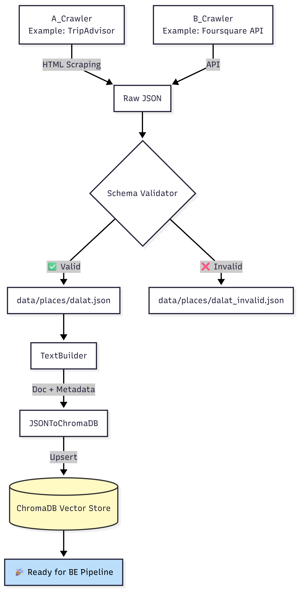

# CRAWL_DATA_CHATBOT - Structure

```
CRAWL_DATA_CHATBOT/
├── config.py                        <= Cấu hình chung: đường dẫn ChromaDB, embedding model, delay crawler, budget threshold
│
├── pipeline.py                      <= Master script: chạy toàn bộ Crawl → Validate → Ingest từ 1 lệnh duy nhất
│
├── requirements.txt                 <= Danh sách dependencies riêng cho crawler (requests, bs4, jsonschema...)
│
├── crawlers/
│   ├── base_crawler.py              <= Abstract base: session management, retry logic, delay, save_raw()
│   ├── tripadvisor_crawler.py       <= Crawl TripAdvisor bằng HTML scraping (BeautifulSoup)
│   └── foursquare_crawler.py        <= Crawl Foursquare bằng REST API (trả về JSON chuẩn)
│
├── validators/
│   ├── schema_validator.py          <= Validate từng place dict: kiểu dữ liệu, range, field bắt buộc, tách valid/invalid
│   └── place_schema.json            <= Định nghĩa JSON Schema chuẩn cho một place object
│
├── ingest/
│   ├── text_builder.py              <= Convert place dict → văn bản tự nhiên + metadata để embed vào ChromaDB
│   └── json_to_chromadb.py          <= Đọc file JSON đã validate → upsert vào ChromaDB theo batch
│
└── data/
    └── places/
        ├── dalat.json               <= Data địa điểm Đà Lạt đã qua validate, sẵn sàng để ingest
        ├── hanoi.json               <= Data địa điểm Hà Nội
        ├── hcmc.json                <= Data địa điểm TP.HCM
        └── danang.json              <= Data địa điểm Đà Nẵng
```

# CRAWL_DATA_CHATBOT - Flow

```
python pipeline.py --region dalat
        ↓
[1] TripAdvisorCrawler.crawl()   →  raw JSON (HTML scraping)
[2] FoursquareCrawler.crawl()    →  raw JSON (API)
        ↓
[3] SchemaValidator.validate_all()
        ├── valid   → data/places/dalat.json
        └── invalid → data/places/dalat_invalid.json  (để review)
        ↓
[4] TextBuilder.build()          →  document text + metadata
        ↓
[5] JSONToChromaDB.ingest_file() →  upsert vào ../BE_ChatBot/db/
        ↓
✅ ChromaDB sẵn sàng cho BE pipeline
```

---

## Thứ tự implement

### Giai đoạn 1 — Nền tảng (không phụ thuộc gì)

**`config.py`** → **`validators/place_schema.json`**

Làm 2 file này trước vì mọi file khác đều import config hoặc dùng schema để biết cấu trúc dữ liệu cần hướng tới.

---

### Giai đoạn 2 — Validation (chỉ phụ thuộc schema)

**`validators/schema_validator.py`**

Implement validator sớm để ngay khi crawl ra data là có thể check ngay, tránh phải debug ngược lại sau.

---

### Giai đoạn 3 — Crawler

**`crawlers/base_crawler.py`** → **`crawlers/foursquare_crawler.py`** → **`crawlers/tripadvisor_crawler.py`**

Foursquare làm trước vì trả về JSON chuẩn, dễ parse hơn nhiều so với TripAdvisor phải scrape HTML. Dùng Foursquare để có data thật sớm, test các bước sau, rồi mới quay lại làm TripAdvisor.

---

### Giai đoạn 4 — Ingest

**`ingest/text_builder.py`** → **`ingest/json_to_chromadb.py`**

`text_builder` làm trước vì `json_to_chromadb` gọi nó. Đây cũng là bước quan trọng nhất về chất lượng — text được build càng tự nhiên thì embedding càng tốt, RAG càng chính xác.

---

### Giai đoạn 5 — Kết nối toàn bộ

**`pipeline.py`**

Làm cuối khi đã test từng phần riêng lẻ chạy ổn.

---

## Checklist theo thứ tự

```
[ ] config.py
[ ] validators/place_schema.json
[ ] validators/schema_validator.py
[ ] crawlers/base_crawler.py
[ ] crawlers/foursquare_crawler.py      ← test crawl thật ở đây
[ ] crawlers/tripadvisor_crawler.py     ← làm sau khi đã có data từ Foursquare
[ ] ingest/text_builder.py              ← quan trọng nhất về chất lượng RAG
[ ] ingest/json_to_chromadb.py
[ ] pipeline.py
```

---

Một lưu ý thực tế: sau khi xong `text_builder.py`, nên test thử bằng cách embed 5–10 place rồi query thủ công trong ChromaDB để đảm bảo text được build ra có ý nghĩa ngữ nghĩa trước khi ingest toàn bộ.


