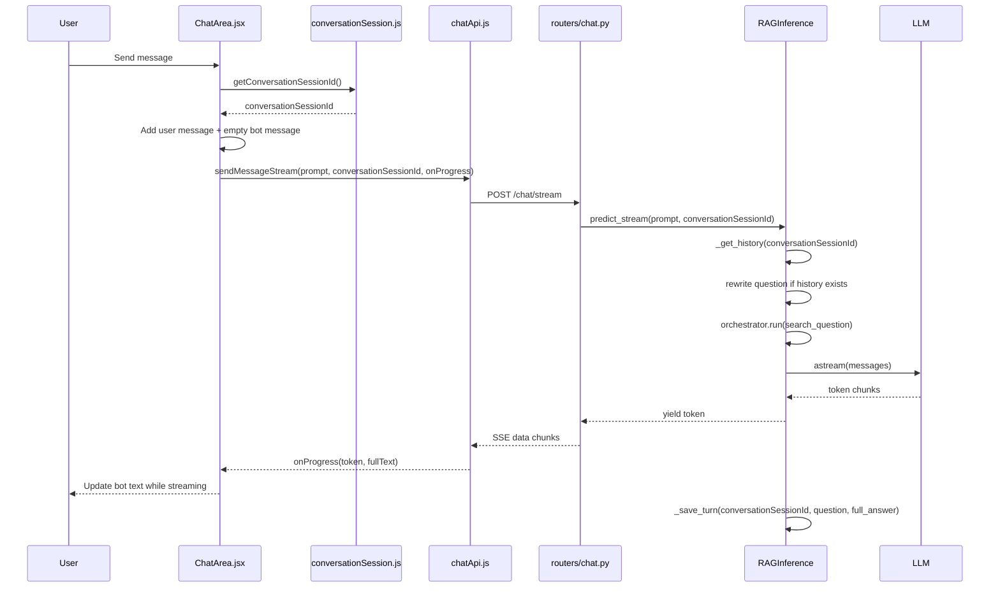

# Hướng dẫn chi tiết: Tích hợp API /chat vào FE

> **Ứng dụng**: Mellow AI - Vietnam Travel ChatBot
> **Kiến trúc**: React (Vite) -> FastAPI -> RAGInference -> LLM
> **Mục tiêu**: Thay mock chat trong FE bằng API thật, hỗ trợ streaming SSE và tách lịch sử hội thoại theo `conversationSessionId`.

---

## Mục lục

- [Tổng quan kiến trúc chat](#tổng-quan-kiến-trúc-chat)
- [Ý tưởng chính của conversationSessionId](#ý-tưởng-chính-của-conversationsessionid)
- [Flow 1: FE gửi message và tạo session tạm](#flow-1-fe-gửi-message-và-tạo-session-tạm)
  - [Bước 1 - ChatArea.jsx: Nhận input và tạo bot message rỗng](#bước-1--chatareajsx-nhận-input-và-tạo-bot-message-rỗng)
  - [Bước 2 - conversationSession.js: Tạo conversationSessionId](#bước-2--conversationsessionjs-tạo-conversationsessionid)
  - [Bước 3 - chatApi.js: Gọi POST /chat/stream](#bước-3--chatapijs-gọi-post-chatstream)
  - [Bước 4 - chatApi.js: Đọc SSE stream](#bước-4--chatapijs-đọc-sse-stream)
  - [Bước 5 - ChatArea.jsx: Cập nhật UI theo từng chunk](#bước-5--chatareajsx-cập-nhật-ui-theo-từng-chunk)
- [Flow 2: BE nhận request và stream câu trả lời](#flow-2-be-nhận-request-và-stream-câu-trả-lời)
  - [Bước 6 - main.py: Khởi tạo RAGInference và register router](#bước-6--mainpy-khởi-tạo-raginference-và-register-router)
  - [Bước 7 - schemas/chat.py: Định nghĩa request body](#bước-7--schemaschatpy-định-nghĩa-request-body)
  - [Bước 8 - routers/chat.py: Endpoint POST /chat/stream](#bước-8--routerschatpy-endpoint-post-chatstream)
  - [Bước 9 - deps_chat.py: Lấy inference engine từ app state](#bước-9--deps_chatpy-lấy-inference-engine-từ-app-state)
  - [Bước 10 - inference.py: Xử lý RAG và stream token](#bước-10--inferencepy-xử-lý-rag-và-stream-token)
- [Flow 3: Kết thúc stream và parse trip plan](#flow-3-kết-thúc-stream-và-parse-trip-plan)
- [Sequence Diagrams](#sequence-diagrams)
- [Tóm tắt file map](#tóm-tắt-file-map)
- [Cách test](#cách-test)
- [Rủi ro và lưu ý sau này](#rủi-ro-và-lưu-ý-sau-này)

---

## Tổng quan kiến trúc chat

```text
FRONTEND (React/Vite)

User nhập message
      |
      v
ChatArea.jsx
  - thêm user message vào state
  - tạo bot message rỗng để nhận stream
  - lấy conversationSessionId
      |
      v
chatApi.sendMessageStream()
  - POST /chat/stream
  - body: { prompt, conversationSessionId }
  - đọc SSE bằng fetch + ReadableStream
      |
      v
BACKEND (FastAPI)

routers/chat.py
  - validate ChatRequest
  - gọi RAGInference.predict_stream()
      |
      v
RAGInference
  - lấy history theo conversationSessionId
  - rewrite question nếu có history
  - retrieve/rerank docs
  - build prompt
  - stream token từ LLM
  - lưu turn vào history sau khi stream xong
```

> [!IMPORTANT]
> `conversationSessionId` hiện tại là ID tạm do FE tạo và lưu trong `sessionStorage`.
> Sau này khi có conversation DB thật, giá trị này nên được thay bằng `conversation.id`.

---

## Ý tưởng chính của conversationSessionId

`RAGInference` đã có history store theo session:

```python
self._history: dict[str, list] = defaultdict(list)
```

Nếu FE không gửi session riêng, tất cả request sẽ rơi về `"default"` và có nguy cơ dùng chung history.

MVP hiện tại xử lý bằng cách:

1. FE tạo `conversationSessionId` bằng `crypto.randomUUID()`.
2. FE lưu vào `sessionStorage`.
3. Mỗi request chat gửi kèm `conversationSessionId`.
4. BE dùng `conversationSessionId` như `session_id` để đọc/ghi history trong RAM.

### Tại sao dùng sessionStorage?

- Mỗi browser tab có session riêng.
- Reload page vẫn giữ được context trong cùng tab.
- Đóng tab thì session tạm biến mất.
- Phù hợp với MVP trước khi có bảng `conversations` thật.

### Sau này thay bằng conversation.id như nào?

Hiện tại:

```js
const conversationSessionIdRef = useRef(getConversationSessionId());
```

Sau này:

```js
const conversationSessionIdRef = useRef(conversation.id);
```

Hoặc khi user chọn chat trong sidebar:

```js
conversationSessionIdRef.current = selectedConversation.id;
```

Tên biến `conversationSessionId` được giữ có chủ đích: nó nói rõ đây là session của conversation, nhưng chưa ràng buộc DB trong MVP.

---

## Flow 1: FE gửi message và tạo session tạm

### Bước 1 - ChatArea.jsx: Nhận input và tạo bot message rỗng

File: [ChatArea.jsx](file:///d:/KLTN/Project/FE_ChatBot/src/ui/ChatArea.jsx)

#### Công dụng

`ChatArea.jsx` là nơi điều phối chat UI:

- Nhận text từ `ChatInput`
- Thêm message của user vào state
- Tạo message bot rỗng để stream text vào
- Gọi `chatApi.sendMessageStream()`
- Khi stream xong, parse JSON trip plan nếu có
- Cập nhật message cuối cùng thành kết quả final

#### Đoạn liên quan

```jsx
const [messages, setMessages] = useState([]);
const [loading, setLoading] = useState(false);
const bottomRef = useRef(null);
const conversationSessionIdRef = useRef(getConversationSessionId());
```

`conversationSessionIdRef` được tạo một lần khi component mount. Dùng `useRef` để:

- Không tạo ID mới mỗi lần render
- Giữ cùng một ID cho các message trong cùng chat
- Tránh trigger re-render không cần thiết

#### Khi user bấm send

```jsx
const handleSend = async (text) => {
  if (!text.trim()) return;

  setMessages((prev) => [...prev, { text, sender: "user" }]);
  setLoading(true);

  setMessages((prev) => [
    ...prev,
    { text: "", sender: "bot", isStreaming: true },
  ]);

  try {
    const res = await chatApi.sendMessageStream(
      text,
      conversationSessionIdRef.current,
      (chunk, fullTextSoFar) => {
        // update streaming UI
      },
    );
    // handle final response
  } catch (err) {
    // show error
  } finally {
    setLoading(false);
  }
};
```

> [!NOTE]
> Bot message rỗng được tạo trước khi gọi API. Khi SSE chunk về, FE cập nhật message cuối cùng thay vì thêm message mới cho từng chunk.

---

### Bước 2 - conversationSession.js: Tạo conversationSessionId

File: [conversationSession.js](file:///d:/KLTN/Project/FE_ChatBot/src/services/conversationSession.js)

#### Công dụng

File này quản lý ID tạm cho một conversation ở FE.

```js
const CONVERSATION_SESSION_ID_KEY = "conversationSessionId";
```

Key này được lưu trong `sessionStorage`, không phải `localStorage`.

#### Tạo ID mới

```js
const createConversationSessionId = () => {
  if (crypto?.randomUUID) {
    return crypto.randomUUID();
  }

  return `conversation-${Date.now()}-${Math.random().toString(36).slice(2)}`;
};
```

Mặc định dùng `crypto.randomUUID()`. Fallback chỉ dùng khi browser không hỗ trợ.

#### Lấy ID hiện tại

```js
export const getConversationSessionId = () => {
  const existingConversationSessionId = sessionStorage.getItem(
    CONVERSATION_SESSION_ID_KEY,
  );

  if (existingConversationSessionId) {
    return existingConversationSessionId;
  }

  const conversationSessionId = createConversationSessionId();
  sessionStorage.setItem(CONVERSATION_SESSION_ID_KEY, conversationSessionId);
  return conversationSessionId;
};
```

Nếu session đã có ID thì dùng lại. Nếu chưa có thì tạo mới.

#### Reset ID

```js
export const resetConversationSessionId = () => {
  const conversationSessionId = createConversationSessionId();
  sessionStorage.setItem(CONVERSATION_SESSION_ID_KEY, conversationSessionId);
  return conversationSessionId;
};
```

Hiện tại function này chưa được nối vào UI. Sau này có nút "New Chat" thì dùng function này hoặc thay bằng `conversation.id` mới từ DB.

---

### Bước 3 - chatApi.js: Gọi POST /chat/stream

File: [chatApi.js](file:///d:/KLTN/Project/FE_ChatBot/src/services/chatApi.js)

#### Công dụng

`chatApi.js` là service gọi API chat thật. File này đã thay mock streaming bằng:

- `fetch()`
- `ReadableStream`
- SSE parser
- callback `onProgress(token, fullText)`

#### Base URL

```js
const BASE_URL = import.meta.env.VITE_FASTAPI_URL;

if (!BASE_URL) {
  throw new Error("VITE_FASTAPI_URL not found");
}
```

FE phụ thuộc vào biến môi trường:

```text
VITE_FASTAPI_URL=http://localhost:8000
```

#### Gọi endpoint stream

```js
const response = await fetch(`${BASE_URL}/chat/stream`, {
  method: "POST",
  headers: {
    "Content-Type": "application/json",
    ...(token && { Authorization: `Bearer ${token}` }),
  },
  body: JSON.stringify({ prompt, conversationSessionId }),
});
```

Body gửi lên BE:

```json
{
  "prompt": "Đà Lạt có gì vui?",
  "conversationSessionId": "uuid-tam-cua-fe"
}
```

> [!NOTE]
> Header Authorization vẫn được gắn nếu có `access_token`, nhưng endpoint `/chat/stream` hiện tại chưa bắt buộc auth. Đây là bước chuẩn bị cho khi chat gắn với user/conversation DB.

---

### Bước 4 - chatApi.js: Đọc SSE stream

File: [chatApi.js](file:///d:/KLTN/Project/FE_ChatBot/src/services/chatApi.js)

#### Công dụng

BE trả về SSE theo dạng:

```text
data: "một token"

data: "token tiếp theo"

data: [DONE]
```

FE đọc bằng `response.body.getReader()`.

#### Logic đọc stream

```js
const readStream = async (response, onProgress) => {
  const reader = response.body.getReader();
  const decoder = new TextDecoder();
  let fullText = "";
  let buffer = "";

  while (true) {
    const { done, value } = await reader.read();
    if (done) break;

    buffer += decoder.decode(value, { stream: true });
    const events = buffer.split("\n\n");
    buffer = events.pop() || "";

    for (const event of events) {
      const dataLines = event
        .split("\n")
        .filter((line) => line.startsWith("data: "))
        .map((line) => line.slice(6));

      const data = dataLines.join("\n");
      if (!data) continue;
      if (data === "[DONE]") return fullText;

      const token = JSON.parse(data);
      fullText += token;
      onProgress(token, fullText);
    }
  }

  return fullText;
};
```

#### Tại sao token được JSON.parse?

BE gửi token bằng:

```python
json.dumps(token, ensure_ascii=False)
```

Việc này giúp stream an toàn hơn khi token có:

- Dấu xuống dòng
- Dấu nháy
- Ký tự Unicode tiếng Việt
- Markdown
- JSON block trong câu trả lời

---

### Bước 5 - ChatArea.jsx: Cập nhật UI theo từng chunk

File: [ChatArea.jsx](file:///d:/KLTN/Project/FE_ChatBot/src/ui/ChatArea.jsx)

#### Công dụng

Mỗi khi `chatApi.js` đọc được token mới, callback trong `ChatArea` được gọi:

````jsx
(chunk, fullTextSoFar) => {
  setLoading(false);
  setMessages((prev) => {
    const newMsgs = [...prev];
    const lastIndex = newMsgs.length - 1;

    const cleanStreamingText = fullTextSoFar
      .replace(/```json[\s\S]*/i, "")
      .trim();

    newMsgs[lastIndex] = {
      ...newMsgs[lastIndex],
      text: cleanStreamingText,
    };
    return newMsgs;
  });
};
````

#### Tại sao loại bỏ block ```json trong lúc stream?

LLM có thể trả về:

````text
Đây là lịch trình cho bạn...

```json
{ ... trip plan ... }
```
````

Nếu stream trực tiếp JSON block lên UI text, người dùng sẽ thấy UI nhảy/rat dài. Nên trong lúc stream:

- Chỉ hiển thị phần ngôn ngữ tự nhiên
- Tạm bỏ phần bắt đầu từ ```json
- Sau khi stream xong mới parse JSON để render UI riêng

---

## Flow 2: BE nhận request và stream câu trả lời

### Bước 6 - main.py: Khởi tạo RAGInference và register router

File: [main.py](file:///d:/KLTN/Project/BE_ChatBot/src/main.py)

#### Công dụng

`main.py` khởi tạo FastAPI app và tạo một instance `RAGInference` duy nhất trong lifespan:

```python
@asynccontextmanager
async def lifespan(app: FastAPI):
    app.state.inference = RAGInference()
    yield
    app.state.inference = None
```

Router chat được register:

```python
app.include_router(chat.router)
```

#### Tại sao dùng app.state.inference?

`RAGInference` cần load LLM, retriever, orchestrator. Nếu tạo mới mỗi request thì rất tốn chi phí. Dùng `app.state.inference` giúp:

- Khởi tạo một lần khi app start
- Reuse engine cho tất cả request
- Lưu in-memory history theo `conversationSessionId`

> [!WARNING]
> Vì history đang nằm trong RAM của instance này, restart BE sẽ mất history. Sau này khi dùng DB conversation/messages thì cần persist history vào database.

---

### Bước 7 - schemas/chat.py: Định nghĩa request body

File: [chat.py](file:///d:/KLTN/Project/BE_ChatBot/src/schemas/chat.py)

#### Công dụng

Schema request/response cho endpoint chat:

```python
class ChatRequest(BaseModel):
    prompt: str
    conversationSessionId: str = "default"


class ChatResponse(BaseModel):
    response: str
```

#### conversationSessionId dùng để làm gì?

`conversationSessionId` được router truyền vào `RAGInference`:

```python
engine.predict_stream(request.prompt, request.conversationSessionId)
```

Trong MVP, FE tạo ID này. Sau này ID này nên là `conversation.id` từ DB.

#### Tại sao default là "default"?

Để giữ backward compatibility:

- Swagger có thể test chỉ với `{ "prompt": "..." }`
- Endpoint `/chat` cũ vẫn chạy nếu client chưa gửi session
- Gradio/test single-user vẫn có fallback

---

### Bước 8 - routers/chat.py: Endpoint POST /chat/stream

File: [chat.py](file:///d:/KLTN/Project/BE_ChatBot/src/api/routers/chat.py)

#### Công dụng

File này expose hai endpoint:

1. `POST /chat` - response JSON một lần
2. `POST /chat/stream` - stream SSE theo token

#### Endpoint cũ /chat

```python
@router.post("/chat", response_model=ChatResponse)
async def chat(
    request: ChatRequest, engine: RAGInference = Depends(get_inference_service)
):
    response_text = await engine.predict_async(
        request.prompt, request.conversationSessionId
    )
    return ChatResponse(response=response_text)
```

Endpoint này hữu ích để:

- Test Swagger dễ hơn
- Debug khi không cần streaming
- Giữ compatibility với client cũ

#### Endpoint stream /chat/stream

```python
@router.post("/chat/stream")
async def chat_stream(
    request: ChatRequest, engine: RAGInference = Depends(get_inference_service)
):
    async def event_generator():
        async for token in engine.predict_stream(
            request.prompt, request.conversationSessionId
        ):
            yield f"data: {json.dumps(token, ensure_ascii=False)}\n\n"
        yield "data: [DONE]\n\n"

    return StreamingResponse(event_generator(), media_type="text/event-stream")
```

#### Tại sao dùng StreamingResponse?

`StreamingResponse` cho phép BE trả về từng chunk ngay khi LLM sinh token, thay vì đợi cả answer xong mới trả về.

FE sẽ có cảm giác bot đang trả lời theo thời gian thực.

---

### Bước 9 - deps_chat.py: Lấy inference engine từ app state

File: [deps_chat.py](file:///d:/KLTN/Project/BE_ChatBot/src/api/deps_chat.py)

#### Công dụng

FastAPI dependency này lấy engine đã khởi tạo trong `main.py`:

```python
def get_inference_service(request: Request) -> RAGInference:
    inference = getattr(request.app.state, "inference", None)
    if inference is None:
        raise HTTPException(status_code=503, detail="Inferecne Pipeline chua san sang")

    return inference
```

#### Tại sao cần dependency riêng?

Router chat không cần biết engine được khởi tạo ở đâu. Nó chỉ cần khai báo:

```python
engine: RAGInference = Depends(get_inference_service)
```

FastAPI sẽ inject engine vào handler.

---

### Bước 10 - inference.py: Xử lý RAG và stream token

File: [inference.py](file:///d:/KLTN/Project/BE_ChatBot/src/pipeline/inference.py)

#### Công dụng

`RAGInference` là trung tâm xử lý chat:

- Quản lý history
- Rewrite question dựa trên history
- Gọi orchestrator để retrieve/rerank documents
- Build prompt
- Gọi LLM
- Lưu turn mới vào history

#### Lấy history theo session

```python
def _get_history(self, session_id: str) -> list:
    history = self._history[session_id]
    max_messages = _MAX_HISTORY_TURNS * 2
    return history[-max_messages:] if len(history) > max_messages else history
```

`session_id` ở đây chính là `conversationSessionId` FE gửi lên.

#### Stream answer

```python
async def predict_stream(
    self,
    question: str,
    session_id: str = "default",
):
    history = self._get_history(session_id)

    search_question = await self._rewrite_question(question, history)
    reranked_docs = await self.orchestrator.run(search_question)
    context = "\n\n".join(doc.page_content for doc in reranked_docs)
    messages = self._build_messages(history, context, question)

    full_answer = ""
    async for chunk in self.llm.astream(messages):
        token = getattr(chunk, "content", "")
        if token:
            full_answer += token
            yield token

    self._save_turn(session_id, question, full_answer)
```

#### Vì sao save history sau khi stream xong?

Nếu lưu history trước khi stream xong thì answer chưa đầy đủ. Flow hiện tại đúng:

1. Stream token cho FE
2. Gom `full_answer`
3. Sau khi stream kết thúc, lưu `(question, full_answer)` vào history

Lần chat tiếp theo cùng `conversationSessionId` sẽ có context từ các turn trước.

---

## Flow 3: Kết thúc stream và parse trip plan

Sau khi `chatApi.sendMessageStream()` return:

```jsx
const responseText = res?.data?.response ?? "";
```

`ChatArea.jsx` parse JSON nếu response có trip plan:

```jsx
let tripData = null;
try {
  const jsonText = extractJsonFromText(responseText);
  if (jsonText) tripData = JSON.parse(jsonText);
} catch {
  tripData = null;
}
```

Sau đó loại JSON block khỏi text hiển thị:

````jsx
const finalCleanText = responseText.replace(/```json[\s\S]*?```/i, "").trim();
````

Nếu có `tripData`, UI sẽ:

1. Set `isBuildingUI: true`
2. Chờ 1.5s để hiển thị trạng thái đang tạo giao diện
3. Gắn `tripData` vào message cuối cùng
4. `Message.jsx` render UI trip plan

---

## Sequence Diagrams

### FE -> BE -> LLM streaming



### History theo conversationSessionId

```text
conversationSessionId = "A"
  User: "Tôi muốn đi Đà Lạt 2 ngày"
  Bot:  "Gợi ý lịch trình..."
  User: "Còn quán ăn nào ngon?"
  -> BE rewrite câu hỏi dựa trên history của A

conversationSessionId = "B"
  User: "Hội An có gì vui?"
  -> BE không thấy history của A
  -> Context độc lập
```

---

## Tóm tắt file map

| Layer         | File                                             | Vai trò                                                                   |
| ------------- | ------------------------------------------------ | ------------------------------------------------------------------------- |
| FE UI         | `FE_ChatBot/src/ui/ChatArea.jsx`                 | Điều phối input, state messages, streaming UI, parse trip plan sau stream |
| FE Service    | `FE_ChatBot/src/services/conversationSession.js` | Tạo và lưu `conversationSessionId` tạm trong `sessionStorage`             |
| FE Service    | `FE_ChatBot/src/services/chatApi.js`             | Gọi `POST /chat/stream`, đọc SSE, trả về full response                    |
| FE Helper     | `FE_ChatBot/src/helper/extractJsonFromText.js`   | Tách JSON block từ response của LLM                                       |
| FE UI         | `FE_ChatBot/src/ui/Message.jsx`                  | Render message và trip plan UI                                            |
| BE App        | `BE_ChatBot/src/main.py`                         | Khởi tạo `RAGInference`, register chat router                             |
| BE Router     | `BE_ChatBot/src/api/routers/chat.py`             | Expose `/chat` và `/chat/stream`                                          |
| BE Dependency | `BE_ChatBot/src/api/deps_chat.py`                | Lấy `RAGInference` từ `request.app.state`                                 |
| BE Schema     | `BE_ChatBot/src/schemas/chat.py`                 | Định nghĩa `ChatRequest`, `ChatResponse`                                  |
| BE Pipeline   | `BE_ChatBot/src/pipeline/inference.py`           | Xử lý history-aware RAG và stream token                                   |
| BE Pipeline   | `BE_ChatBot/src/pipeline/orchestrator.py`        | Retrieve/rerank documents cho câu hỏi                                     |

---

## Cách test

### Test bằng Swagger

Swagger vẫn test được endpoint JSON:

```http
POST /chat
```

Body:

```json
{
  "prompt": "Đà Lạt có gì vui?",
  "conversationSessionId": "swagger-test-session"
}
```

Expected:

```json
{
  "response": "..."
}
```

> [!NOTE]
> Swagger không phải công cụ tốt để quan sát SSE streaming. Nó có thể đợi response kết thúc mới hiển thị.

### Test streaming bằng curl

```bash
curl -X POST http://localhost:8000/chat/stream \
  -H "Content-Type: application/json" \
  -d '{"prompt":"Đà Lạt có gì vui?","conversationSessionId":"curl-test-session"}' \
  --no-buffer
```

Expected:

```text
data: "..."

data: "..."

data: [DONE]
```

### Test FE

1. Chạy BE:

```bash
uvicorn src.main:app --reload
```

2. Chạy FE:

```bash
npm run dev
```

3. Gửi message trong UI.

Expected:

- Network tab có request `POST /chat/stream`
- Request body có `prompt` và `conversationSessionId`
- Response có `text/event-stream`
- Bot message update dần theo từng chunk
- Lần hỏi tiếp theo trong cùng tab dùng lại same `conversationSessionId`

---

## Rủi ro và lưu ý sau này

### 1. Graph understand-anything cần rebuild sau khi thay code

Nếu muốn `understand-chat` nhìn thấy file mới `conversationSession.js` trong graph, cần chạy lại:

```text
/understand --full
```

### 2. History hiện tại chỉ nằm trong RAM

`RAGInference._history` là in-memory dict. Điều này có nghĩa:

- Restart BE sẽ mất history
- Multi-worker deployment có thể mỗi worker giữ history riêng
- Không đồng bộ giữa nhiều instance backend

Hướng sau này: persist messages vào DB bằng `Conversation` và `Message`.

### 3. conversationSessionId hiện tại là temporary ID

MVP:

```text
conversationSessionId = FE-generated UUID
```

Future:

```text
conversationSessionId = conversation.id
```

Khi có DB conversation, flow mới nên là:

1. User bấm New Chat
2. FE gọi BE tạo conversation
3. BE trả về `conversation.id`
4. FE dùng `conversation.id` làm `conversationSessionId`
5. BE vừa stream answer vừa persist user/bot messages vào DB

### 4. Endpoint stream hiện chưa bắt buộc auth

`chatApi.js` có gửi Authorization nếu có token, nhưng `/chat/stream` hiện tại chưa yêu cầu `get_current_user`.

Sau này nếu chat gắn với user:

- Router cần depends vào auth dependency
- `conversation.id` phải thuộc về current user
- Không cho user A đọc/ghi conversation của user B

### 5. SSE parser đang kỳ vọng data là JSON string

BE gửi:

```python
yield f"data: {json.dumps(token, ensure_ascii=False)}\n\n"
```

FE đọc:

```js
const token = JSON.parse(data);
```

Hai bên phải giữ contract này. Nếu BE đổi sang plain text SSE thì FE parser cũng phải đổi.

---

## Tóm tắt ngắn gọn

Flow hiện tại:

```text
ChatArea
  -> getConversationSessionId()
  -> chatApi.sendMessageStream(prompt, conversationSessionId)
  -> POST /chat/stream
  -> routers/chat.py
  -> RAGInference.predict_stream(prompt, conversationSessionId)
  -> LLM astream
  -> SSE chunks
  -> FE onProgress
  -> UI streaming
```

`conversationSessionId` là cầu nối giữa FE chat UI và BE in-memory history. Hiện tại nó do FE tạo. Sau này nó nên chuyển thành `conversation.id` từ database.
