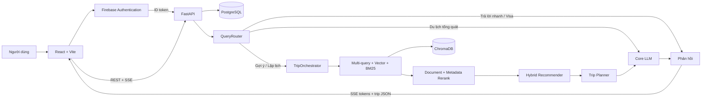

# Vietnam Travel ChatBot

Vietnam Travel ChatBot là hệ thống trợ lý du lịch Việt Nam được xây dựng cho
đồ án khóa luận tốt nghiệp. Hệ thống kết hợp RAG, LLM, gợi ý địa điểm và lập
lịch trình để trả lời câu hỏi du lịch bằng tiếng Việt hoặc tiếng Anh, đồng thời
hỗ trợ đăng nhập, lưu hội thoại và hiển thị lịch trình trực quan trên web.

Luồng chạy được hỗ trợ trực tiếp trong repository là:

```text
React/Vite chạy local
    -> FastAPI chạy trong Docker
    -> PostgreSQL chạy trên máy host
    -> ChromaDB seed trong image và các dịch vụ AI được backend gọi qua API
```

> Repository hiện chưa có Dockerfile cho frontend hoặc `docker-compose.yml`.
> Vì vậy, phần “Chạy bằng Docker” bên dưới dùng Docker cho backend và chạy
> frontend bằng Node.js trên máy host.

## Mục lục

- [Tính năng chính](#tính-năng-chính)
- [Kiến trúc hệ thống](#kiến-trúc-hệ-thống)
- [Công nghệ sử dụng](#công-nghệ-sử-dụng)
- [Dữ liệu](#dữ-liệu)
- [Cấu trúc repository](#cấu-trúc-repository)
- [Chạy dự án bằng Docker](#chạy-dự-án-bằng-docker)
- [Demo end-to-end](#demo-end-to-end)
- [Các thao tác Docker thường dùng](#các-thao-tác-docker-thường-dùng)
- [Chạy toàn bộ dự án ở local](#chạy-toàn-bộ-dự-án-ở-local)
- [API chính](#api-chính)
- [Đánh giá hệ thống](#đánh-giá-hệ-thống)
- [Xử lý lỗi thường gặp](#xử-lý-lỗi-thường-gặp)
- [Giới hạn hiện tại](#giới-hạn-hiện-tại)
- [Tài liệu liên quan](#tài-liệu-liên-quan)
- [Bảo mật](#bảo-mật)
- [Giấy phép](#giấy-phép)

## Tính năng chính

- Đăng nhập Google bằng Firebase Authentication và xác thực Firebase ID token
  tại backend.
- Phân loại truy vấn theo ngôn ngữ, ý định và hành động xử lý bằng
  `QueryRouter`.
- Trả lời hội thoại ngắn, câu hỏi ngoài phạm vi, câu hỏi du lịch tổng quát,
  yêu cầu gợi ý và yêu cầu lập lịch trình theo các nhánh riêng.
- RAG đa truy vấn với Hybrid Search gồm Vector Search và BM25; mặc định người
  dùng có thể điều chỉnh cặp trọng số bổ sung `60/40`.
- Rerank tài liệu, rerank theo metadata và đề xuất địa điểm theo điểm nội dung
  kết hợp vị trí.
- Lập lịch trình nhiều ngày từ các địa điểm được đề xuất, có xét thời lượng
  tham quan, thời gian di chuyển ước tính và giới hạn kết thúc ngày.
- Tư vấn thời tiết từ Open-Meteo trong phạm vi dự báo; dùng dữ liệu khí hậu
  tổng quan khi chuyến đi nằm ngoài phạm vi này.
- Tư vấn visa dựa trên quốc gia cấp hộ chiếu và dữ liệu visa có ghi ngày kiểm
  tra cùng nguồn tham khảo trong repository.
- Ước tính thời điểm khởi hành cho đường bộ hoặc chuyến bay, đồng thời hỏi lại
  khi thiếu dữ liệu bắt buộc.
- Hiển thị phí vào cửa và tổng hợp ngân sách với độ phủ dữ liệu rõ ràng; giá trị
  phí chưa xác định không được xem là miễn phí.
- Streaming câu trả lời qua Server-Sent Events (SSE).
- Lưu người dùng, hội thoại và tin nhắn trong PostgreSQL; hỗ trợ xem lại, đổi
  tên và xóa mềm hội thoại.
- Hiển thị kết quả dưới dạng văn bản, timeline và mind map trên frontend.

## Kiến trúc hệ thống



Luồng gợi ý/lập lịch chính:

```text
QueryAnalyzer
    -> Multi-query Hybrid Retrieval
    -> Document Reranker
    -> chuyển Document thành Place
    -> Metadata Reranker
    -> Hybrid Recommender
    -> Trip Planner (nếu là yêu cầu lập lịch)
    -> LLM tạo câu trả lời
    -> JSON có cấu trúc để frontend hiển thị
```

## Công nghệ sử dụng

| Thành phần           | Công nghệ                                                       |
| -------------------- | --------------------------------------------------------------- |
| Frontend             | React 19.2.4, Vite 7.3.2, Tailwind CSS 4.2.1, Axios, React Flow |
| Backend API          | Python 3.12, FastAPI, Uvicorn, Pydantic                         |
| AI orchestration     | LangChain                                                       |
| Vector database      | ChromaDB, collection `kltn_chatbot`                             |
| Retrieval            | Google Embedding, Vector Search, BM25, Multi-query retrieval    |
| Reranking            | Cohere API trong Docker; code cũng hỗ trợ Hugging Face local    |
| Recommendation       | Metadata reranking, Content-based và Location-based scoring     |
| Planning             | Weighted graph, Dijkstra, 2-opt local search và Scheduler       |
| Authentication       | Firebase Authentication và Firebase Admin SDK                   |
| Application database | PostgreSQL, SQLAlchemy                                          |
| External data        | Open-Meteo, dữ liệu visa và dữ liệu thời gian di chuyển tĩnh    |
| Deployment           | Docker cho backend; cấu hình tham khảo Railway và Netlify       |

Baseline Docker đã được cấu hình theo các provider sau:

| Vai trò                | Provider / model                       |
| ---------------------- | -------------------------------------- |
| Core LLM               | Ollama Cloud / `gemma4:cloud`          |
| Rewrite và Multi-query | Groq / `openai/gpt-oss-20b`            |
| Embedding              | Google / `models/gemini-embedding-001` |
| Document reranker      | Cohere / `rerank-v3.5`                 |

Codebase còn có adapter cho NVIDIA, Gemini, Ollama local và một số provider
local khác. Tuy nhiên, khi dùng ChromaDB đã commit, cấu hình embedding phải giữ
đúng `google / models/gemini-embedding-001` để khớp metadata của vector store.

## Dữ liệu

Repository chứa 600 địa điểm thuộc sáu khu vực, mỗi khu vực 100 địa điểm:

- Đà Lạt
- Đà Nẵng
- Hà Nội
- Thành phố Hồ Chí Minh
- Nha Trang
- Vũng Tàu

Dữ liệu nguồn nằm tại `BE_ChatBot/src/source_data/places_data/`. Backend Docker
truy xuất từ ChromaDB seed tại `BE_ChatBot/src/db/chroma_db/`, hiện có:

```text
Collection: kltn_chatbot
Vectors: 600
Dimension: 3072
Embedding provider: google
Embedding model: models/gemini-embedding-001
```

Các trường metadata chính gồm tên địa điểm, khu vực, loại, tags, tọa độ, rating,
giờ mở/đóng cửa, thời lượng tham quan, thời điểm phù hợp và phí vào cửa nếu có.

## Cấu trúc repository

```text
Project/
├── README.md
├── run_be_fe_local.ps1          # Chạy cả BE và FE trực tiếp trên Windows
├── BE_ChatBot/
│   ├── Dockerfile
│   ├── run_docker_be.ps1        # Build/recreate backend Docker
│   ├── requirements.deploy.txt  # Dependency dành cho Docker/cloud
│   ├── requirements.txt         # Dependency phát triển local đầy đủ
│   ├── src/
│   │   ├── api/                 # FastAPI routers và dependencies
│   │   ├── core/                # Config, Firebase, LLM và embedding adapters
│   │   ├── db/                  # PostgreSQL session, models và ChromaDB seed
│   │   ├── eval/                # Benchmark dataset/retrieval/output
│   │   ├── pipeline/            # Router, RAG, reranker, inference, orchestrator
│   │   ├── planning/            # Graph, route optimizer và scheduler
│   │   ├── recommend/           # Content/location/hybrid recommender
│   │   ├── services/            # Weather, visa, timing và conversation services
│   │   ├── source_data/         # Place, visa và travel-time data
│   │   └── main.py              # FastAPI entrypoint
│   └── test/                    # Test và manual smoke scripts
├── FE_ChatBot/
│   ├── public/
│   ├── src/
│   │   ├── api/                 # Axios client
│   │   ├── config/              # Firebase web config
│   │   ├── features/            # Navigation và trực quan hóa kết quả
│   │   ├── services/            # Auth, chat và conversation API
│   │   └── ui/                  # Chat layout, input và message components
│   ├── package.json
│   └── package-lock.json
└── CRAWL_DATA_CHATBOT/          # Thu thập, làm sạch, enrich và ingest dữ liệu
```

## Chạy dự án bằng Docker

### 1. Yêu cầu hệ thống

- Git.
- Docker Desktop đang chạy Linux containers.
- PostgreSQL đang chạy trên máy host tại port `5432`.
- Node.js thỏa điều kiện của Vite: `^20.19.0` hoặc `>=22.12.0`.
- Một Firebase project đã bật Google Sign-In.
- API key cho Google Gemini, Groq, Ollama Cloud và Cohere theo baseline ở trên.
- PowerShell để chạy script có sẵn.

Kiểm tra nhanh:

```powershell
docker version
Test-NetConnection localhost -Port 5432
node --version
npm --version
```

### 2. Clone repository

```powershell
git clone <repository-url>
cd <repository-folder>
```

### 3. Tạo database PostgreSQL

Tạo database qua `psql`, pgAdmin hoặc công cụ PostgreSQL tương đương:

```sql
CREATE DATABASE kltn_chatbot_deploy;
```

Script Docker chỉ kết nối tới database đã có; script không tự tạo database.

### 4. Cấu hình backend

Tạo file `BE_ChatBot/.env`. Mẫu sau khớp với ChromaDB và bộ dependency Docker
đã commit:

```env
# PostgreSQL
# Dùng khi chạy backend trực tiếp trên Windows (không bắt buộc cho Docker)
DATABASE_URL=postgresql+psycopg2://postgres:<password>@localhost:5432/kltn

# Bắt buộc đối với run_docker_be.ps1
DOCKER_DATABASE_URL=postgresql+psycopg2://postgres:<password>@host.docker.internal:5432/kltn_chatbot_deploy
SQL_ECHO=false

# URL frontend được CORS cho phép
FRONTEND_URL=http://localhost:5173

# Dữ liệu và prompt
PERSIST_DIRECTORY=src/db/chroma_db
SYSTEM_PROMPT=src/prompts/system_prompt.md

# Embedding phải khớp ChromaDB đã commit
EMBEDDING_PROVIDER=google
EMBEDDING_MODEL=models/gemini-embedding-001
GEMINI_API_KEY=<your-gemini-api-key>

# Core LLM
LLM_PROVIDER=ollama_cloud
LLM_MODEL=gemma4:cloud
OLLAMA_API_KEY=<your-ollama-api-key>

# Rewrite và Multi-query
REWRITE_LLM_PROVIDER=groq
REWRITE_LLM_MODEL=openai/gpt-oss-20b
GROQ_API_KEY=<your-groq-api-key>

# Document reranker dành cho Docker
RERANKER_PROVIDER=cohere
RERANKER_MODEL_NAME=rerank-v3.5
RERANKER_TOP_N=20
COHERE_API_KEY=<your-cohere-api-key>

# Dùng khi chạy backend trực tiếp trên Windows
FIREBASE_CREDENTIALS_PATH=config/firebase-service-account.json
```

Tải Firebase Admin service account từ Firebase Console và đặt tại:

```text
BE_ChatBot/config/firebase-service-account.json
```

`run_docker_be.ps1` đọc file này và truyền nội dung vào container thông qua
`FIREBASE_CREDENTIALS_JSON`; không cần tự minify JSON hoặc export biến đó.

> Không commit `.env` hoặc Firebase service account. Hai loại file này đã được
> cấu hình trong `.gitignore` và `.dockerignore`.

### 5. Build và chạy backend Docker

Từ thư mục gốc repository:

```powershell
cd .\BE_ChatBot
powershell -ExecutionPolicy Bypass -File .\run_docker_be.ps1 -Build
```

Script sẽ:

1. Build image `be-chatbot:railway-free`.
2. Xóa container `be-chatbot-deploy` cũ nếu tồn tại.
3. Đọc `DOCKER_DATABASE_URL` và chuyển host local thành
   `host.docker.internal` khi cần.
4. Đưa Firebase credentials vào environment của container.
5. Chạy backend ở port `8000` với giới hạn `1 CPU` và `512 MB RAM`.

Theo dõi quá trình khởi động:

```powershell
docker logs -f --tail 100 be-chatbot-deploy
```

Backend sẵn sàng khi log có `Application startup complete`.

### 6. Khởi tạo bảng database

Chạy một lần sau khi tạo database mới:

```powershell
docker exec be-chatbot-deploy python -m src.db.init_db
```

Kết quả mong đợi:

```text
Database tables initialized successfully
```

Lệnh dùng `create_all`, nên chạy lại không xóa bảng hoặc dữ liệu hiện có.

### 7. Kiểm tra backend

```powershell
Invoke-RestMethod http://127.0.0.1:8000/health
```

Kết quả mong đợi:

```text
status
------
ok
```

Tài liệu API:

- Swagger UI: <http://127.0.0.1:8000/docs>
- ReDoc: <http://127.0.0.1:8000/redoc>

### 8. Cấu hình frontend

Tạo file `FE_ChatBot/.env`:

```env
VITE_FASTAPI_URL=http://127.0.0.1:8000

VITE_FIREBASE_API_KEY=<your-firebase-web-api-key>
VITE_FIREBASE_AUTH_DOMAIN=<your-project>.firebaseapp.com
VITE_FIREBASE_PROJECT_ID=<your-project-id>
VITE_FIREBASE_STORAGE_BUCKET=<your-storage-bucket>
VITE_FIREBASE_MESSAGING_SENDER_ID=<your-messaging-sender-id>
VITE_FIREBASE_APP_ID=<your-app-id>
```

Firebase Web App của frontend và Firebase Admin service account của backend
phải thuộc cùng Firebase project.

### 9. Cài dependency và chạy frontend

Mở PowerShell khác tại thư mục gốc repository:

```powershell
cd .\FE_ChatBot
npm ci
npm run dev
```

Mở <http://localhost:5173>, đăng nhập Google và gửi một truy vấn du lịch.

## Demo end-to-end

> **Điều kiện bắt buộc:** Phải khởi động thành công cả backend và frontend
> trước khi thực hiện demo. Backend phải trả `status: ok` tại
> <http://127.0.0.1:8000/health> và frontend phải truy cập được tại
> <http://localhost:5173>.

Sau khi đăng nhập Google trên frontend, nhập nguyên văn truy vấn sau vào khung
chat:

```text
Lập lịch trình khám phá Đà Lạt 2 ngày từ 02/09/2026, ưu tiên biển, cảnh đẹp và ẩm thực, ngân sách 3 triệu đồng, xuất phát từ Thành phố Hồ Chí Minh bằng máy bay; ngày đầu tôi muốn có mặt và bắt đầu tham quan điểm đầu tiên lúc 10:00, chuyến bay khởi hành lúc 06:00, thời gian ra sân bay là 45 phút, thời gian bay 80 phút.
```

Demo này cần luồng end-to-end vì frontend gửi Firebase ID token và nhận phản
hồi SSE từ backend; backend tiếp tục xử lý truy vấn, truy xuất ChromaDB, gọi các
provider AI và lưu hội thoại vào PostgreSQL.

## Các thao tác Docker thường dùng

| Trường hợp                                                          | Lệnh tại `BE_ChatBot/`                                                |
| ------------------------------------------------------------------- | --------------------------------------------------------------------- |
| Lần đầu chạy hoặc backend/Dockerfile/dependency thay đổi            | `powershell -ExecutionPolicy Bypass -File .\run_docker_be.ps1 -Build` |
| Chỉ đổi `.env`, Firebase credentials, port hoặc giới hạn tài nguyên | `powershell -ExecutionPolicy Bypass -File .\run_docker_be.ps1`        |
| Không có thay đổi và container chỉ đang dừng                        | `docker start be-chatbot-deploy`                                      |
| Dừng nhưng giữ container                                            | `docker stop be-chatbot-deploy`                                       |
| Xóa container nhưng giữ image và PostgreSQL                         | `docker rm -f be-chatbot-deploy`                                      |
| Xem log                                                             | `docker logs -f --tail 100 be-chatbot-deploy`                         |
| Xem tài nguyên                                                      | `docker stats be-chatbot-deploy --no-stream`                          |

`docker restart` không đọc lại `.env` và container đang chạy không tự cập nhật
source code. Dùng script không có `-Build` để tạo lại container khi chỉ đổi cấu
hình; dùng `-Build` khi image cần chứa code hoặc artifact mới.

## Chạy toàn bộ dự án ở local

Cách này dành cho phát triển và không dùng Docker cho backend.

### 1. Chuẩn bị backend

```powershell
cd .\BE_ChatBot
py -3.12 -m venv .venv
.\.venv\Scripts\python.exe -m pip install -r requirements.txt
.\.venv\Scripts\python.exe -m src.db.init_db
```

`DATABASE_URL` và `FIREBASE_CREDENTIALS_PATH` trong `BE_ChatBot/.env` phải trỏ
đến database và service account local hợp lệ.

### 2. Chuẩn bị frontend

```powershell
cd ..\FE_ChatBot
npm ci
```

### 3. Chạy BE và FE

Từ thư mục gốc repository:

```powershell
powershell -ExecutionPolicy Bypass -File .\run_be_fe_local.ps1
```

Script chờ backend trả `/health`, sau đó khởi động Vite. Nhấn `Ctrl+C` để dừng
các tiến trình do script tạo.

## API chính

Ngoại trừ `/health` và trang tài liệu API, các endpoint nghiệp vụ đều yêu cầu:

```http
Authorization: Bearer <firebase-id-token>
```

| Method   | Endpoint                       | Chức năng                                    |
| -------- | ------------------------------ | -------------------------------------------- |
| `GET`    | `/health`                      | Kiểm tra backend                             |
| `POST`   | `/auth/firebase-login`         | Xác thực ID token và tạo/cập nhật người dùng |
| `GET`    | `/auth/me`                     | Lấy thông tin người dùng hiện tại            |
| `POST`   | `/chat`                        | Trả câu trả lời hoàn chỉnh                   |
| `POST`   | `/chat/stream`                 | Stream câu trả lời bằng SSE                  |
| `GET`    | `/conversations`               | Lấy danh sách hội thoại                      |
| `GET`    | `/conversations/{id}/messages` | Lấy tin nhắn của một hội thoại               |
| `PATCH`  | `/conversations/{id}/title`    | Đổi tên hội thoại                            |
| `DELETE` | `/conversations/{id}`          | Xóa mềm hội thoại                            |

Ví dụ body cho `/chat` hoặc `/chat/stream`:

```json
{
  "prompt": "Lập lịch trình Đà Nẵng 3 ngày cho tôi",
  "conversation_id": null,
  "retrieval_vector_weight": 0.6,
  "recommendation_content_weight": 0.6
}
```

Hai trọng số nhận giá trị từ `0.0` đến `1.0`:

- `retrieval_vector_weight`: phần Vector Search; phần BM25 được tính bằng
  `1 - retrieval_vector_weight`.
- `recommendation_content_weight`: phần Content-based; phần Location-based
  được tính bằng `1 - recommendation_content_weight`.

`/chat/stream` gửi event `meta` chứa `conversation_id`, tiếp theo là các token
SSE và kết thúc bằng `[DONE]`.

## Đánh giá hệ thống

Bộ benchmark trong `BE_ChatBot/src/eval/` gồm:

- Dataset Coverage trên 600 địa điểm.
- Retrieval Quality với Precision@K, Recall@5, nDCG@5, latency và mức cải thiện
  sau rerank.
- Output Validity với kiểm tra số ngày, đúng khu vực, độ đầy đủ của field và
  end-to-end latency.

Kiểm tra tĩnh, không gọi LLM, Chroma hoặc reranker:

```powershell
cd .\BE_ChatBot
python -m src.eval.self_check
```

Đo riêng Dataset Coverage, không gọi LLM:

```powershell
python -m src.eval.dataset.coverage
```

Các benchmark retrieval/output có thể gọi API bên ngoài và tiêu tốn quota. Xem
hướng dẫn đầy đủ tại `BE_ChatBot/src/eval/README.md` trước khi chạy.

## Xử lý lỗi thường gặp

### `Docker Desktop chua san sang`

Mở Docker Desktop, chờ engine sẵn sàng rồi chạy:

```powershell
docker info
```

### `Khong tim thay image be-chatbot:railway-free`

Build image ở lần chạy đầu:

```powershell
powershell -ExecutionPolicy Bypass -File .\run_docker_be.ps1 -Build
```

### Backend không kết nối được PostgreSQL

Kiểm tra PostgreSQL, port, database và credentials:

```powershell
Test-NetConnection localhost -Port 5432
```

Trong container, host phải là `host.docker.internal`, không phải `localhost`.
Đảm bảo database `kltn_chatbot_deploy` đã tồn tại.

### `ChromaDB embedding configuration does not match .env`

ChromaDB đã commit dùng:

```env
EMBEDDING_PROVIDER=google
EMBEDDING_MODEL=models/gemini-embedding-001
```

Khôi phục đúng hai giá trị này và tạo lại container. Chỉ rebuild ChromaDB bằng
`BE_ChatBot/utils/build_rag_vector_db.ipynb` khi chủ động thay embedding model.

### Frontend báo `VITE_FASTAPI_URL not found`

Tạo `FE_ChatBot/.env`, đặt `VITE_FASTAPI_URL=http://127.0.0.1:8000`, rồi khởi
động lại Vite.

### Lỗi CORS

Truy cập frontend bằng <http://localhost:5173>. Script Docker đặt
`FRONTEND_URL=http://localhost:5173`; origin khác sẽ không được CORS cho phép.

### API trả `401 Missing bearer token`

Đăng nhập Google trên frontend hoặc gửi Firebase ID token hợp lệ trong header
`Authorization: Bearer ...`.

### Firebase login thất bại

Kiểm tra:

- Google Sign-In đã được bật trong Firebase Authentication.
- Firebase Web App và service account cùng project.
- `BE_ChatBot/config/firebase-service-account.json` tồn tại.
- Các biến `VITE_FIREBASE_*` đã được khai báo và Vite đã được restart.

## Giới hạn hiện tại

- Tập dữ liệu địa điểm tập trung ở sáu khu vực đã liệt kê, không đại diện cho
  toàn bộ Việt Nam.
- Dự báo thời tiết thời gian thực phụ thuộc Open-Meteo và chỉ áp dụng trong
  phạm vi tối đa 16 ngày; thời gian xa hơn dùng profile khí hậu tĩnh.
- Thời gian di chuyển và thời điểm khởi hành là giá trị ước tính từ profile tĩnh,
  tọa độ/Haversine và dữ liệu cấu hình, không phải ETA giao thông thời gian thực.
- Thuật toán lập tuyến dùng heuristic và local search; kết quả không được xem là
  tối ưu toàn cục.
- Phí vào cửa có độ phủ một phần. Giá trị chưa xác định là “chưa phân loại”,
  không phải miễn phí và không đủ để kết luận toàn bộ chuyến đi phù hợp ngân sách.
- Nội dung visa chỉ mang tính tham khảo theo dữ liệu đã lưu; người dùng cần kiểm
  tra lại với cơ quan ngoại giao chính thức trước chuyến đi.
- Các provider AI bên ngoài có thể gặp giới hạn quota, rate limit hoặc lỗi mạng.

## Tài liệu liên quan

- [Workflow BE Docker + FE local](BE_ChatBot/Workflow%20BE%20Docker_FE%20local.md)
- [Kế hoạch triển khai Railway/Netlify](BE_ChatBot/DEPLOYMENT_PLAN.md)
- [Tài liệu benchmark](BE_ChatBot/src/eval/README.md)
- [Báo cáo benchmark hiện có](BE_ChatBot/src/eval/outputs/benchmark_report.md)
- [Luồng đăng nhập/đăng xuất](ONBOARD_FLOW/login_logout_flow.md)
- [Luồng tích hợp Chat API](ONBOARD_FLOW/chat_API_integration_flow.md)
- [Data crawler](CRAWL_DATA_CHATBOT/README_CRAWL_DATA_CHATBOT.md)

## Bảo mật

- Không commit `.env`, API key, access token hoặc Firebase service account.
- Không đưa secret vào issue, log, screenshot hoặc tài liệu benchmark.
- Frontend lưu Firebase ID token trong `localStorage`; tránh sử dụng token lấy
  từ môi trường production cho mục đích kiểm thử công khai.
- Khi chia sẻ cấu hình, chỉ chia sẻ tên provider/model và dùng placeholder cho
  mọi credentials.

## Giấy phép

Dự án được xây dựng phục vụ mục đích học thuật và khóa luận tốt nghiệp.
